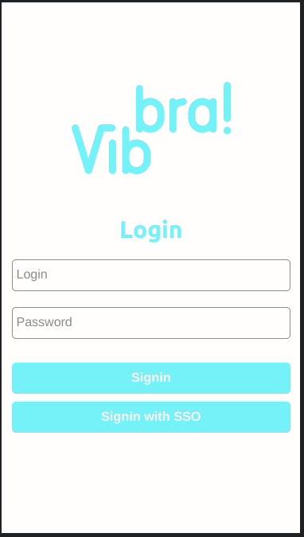
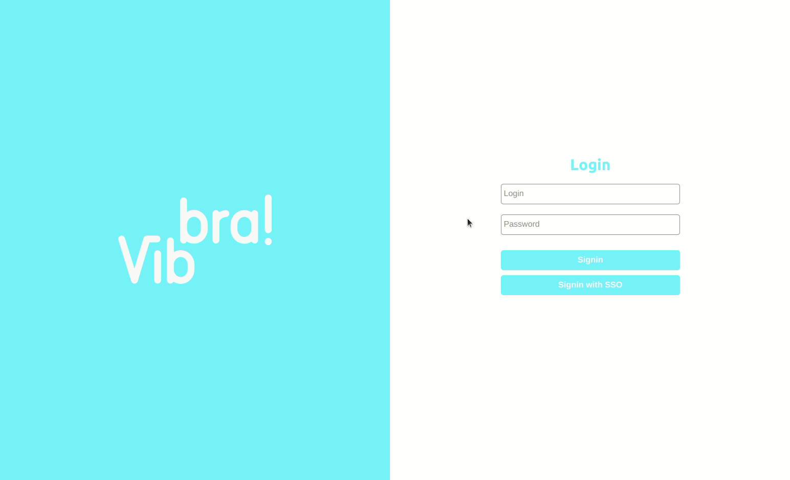

# Vibbra Compra e Venda

## 1 - Avaliação de Escopo
O escopo foi analisado e as dúvidas foram tiradas com o cliente, eventuais futuras dúvidas, faz-se necessário novas interações.
## 2 - Estimativa em horas de todo o desenvolvimento

- Criação de Mock para API [08h]
- Tela de Login [12h]
- Tela da Home da Aplicação [12h]
- Tela de Criação de Negociação [12h]
- Tela de Visualização da Negociação [24h]
	- Funcionalidades Criador de Ofertas
	- Funcionalidades Demais Usuários
- Tela de Minhas Negociações [12h]
- Tela de Meus Convites [24h]
	- Funcionalidade de Criação de Convite
	- Funcionalidade de Alteração de Convite
	- Funcionalidade de Remoção de Convite

Total de horas: [104h]

## 3 - Estimativa em dias do prazo de entrega

30 dias a partir do início do desenvolvimento

## 4 - As horas foram apontadas diariamente

## 5 - Funcionalidades desenvolvidas (entregue para o teste)

Dentre as atividades do escopo, foram desenvolvidos o Login (credenciais e SSO) utilizando o JWT Token e toda a manutenção de convites listagem, criação, alteração e remoção (CRUD). Não foi utilizada nenhuma biblioteca de componentes prontos, todos eles foram contruídos durante o desenvolvimento.

- 1 - Criação de Mock para ambiente de desenvolvimento
- 2 - Tela de login (credenciais e sso)
- 3 - Tela de meus convites
	- Funcionalidade de criação de convite
	- Funcionalidade de alteração de convite
	- Funcionalidade de remoção de convite
- 4 - Desenvolvimento de componentes customizados para o projeto que permitirão a reutilização no desenvolvimento de novas funcionalidades.

## 6 - Ambiente para teste

A versão testável pode ser vista em https://vibbra-vercel.vercel.app/

## Tencnologias utilizadas

- ReactJS
  - Functional Components
  - Hooks
  - Context API
- NextJS
  - Static Site Generator (SSG)
  - API Routes (mocks da API)
- Styled Components
- HTML
- CSS
- Javascript

## Deploy

- Foi escolhida a Vercel para o deploy, pois é um ambiente bem aderente as tecnologias utilizadas.

### Usuários para utilização do sistema

- Usuário 1
  - login: rruiz
  - senha: 1234

- Usuário 2
  - login: ccarvalho
  - senha: 1234

- Usuário 3
  - login: guiruiz
  - senha: 1234

- Usuário 4
  - login: hnaka
  - senha: 1234

Todos eles podem acessar o sistema via opção de login SSO com token da aplicação mockado

## Utilização básica no mobile

## Utilização básica no desktop

